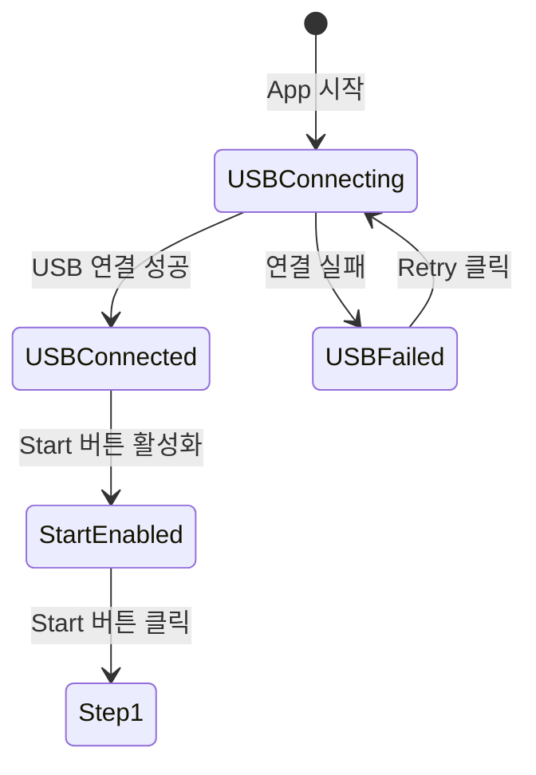
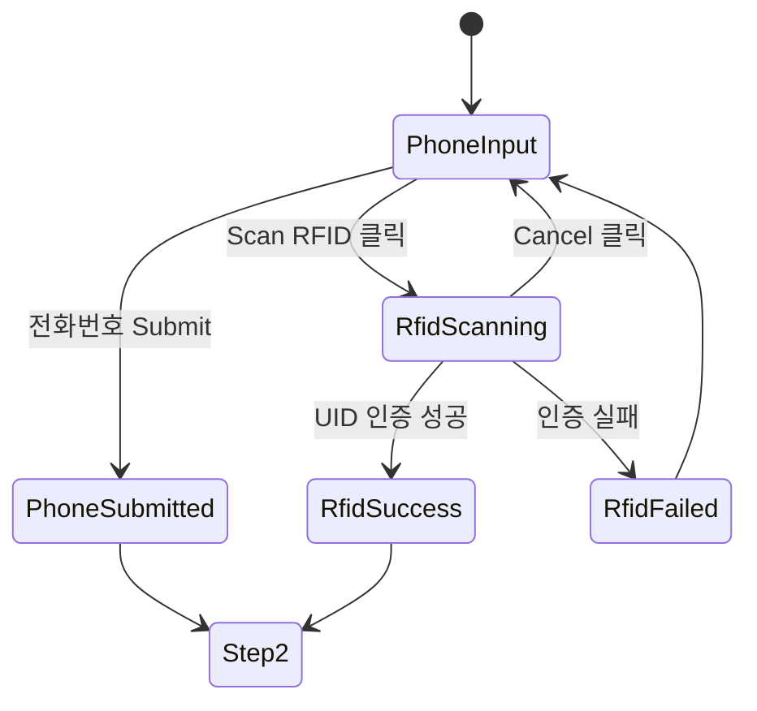
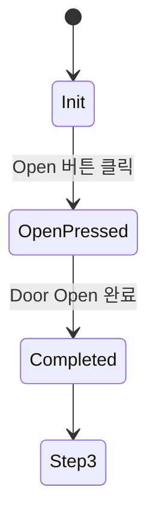
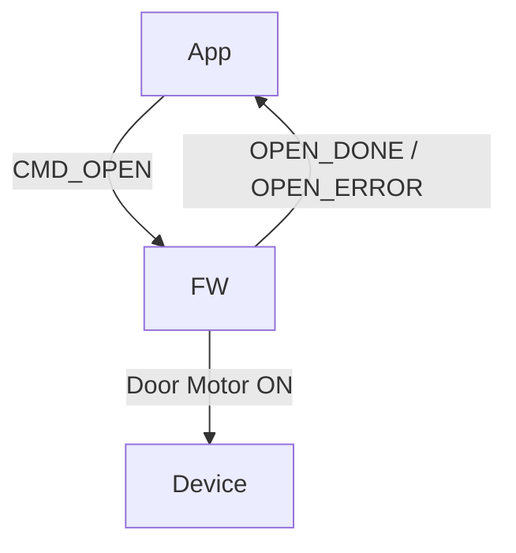
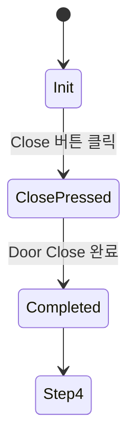
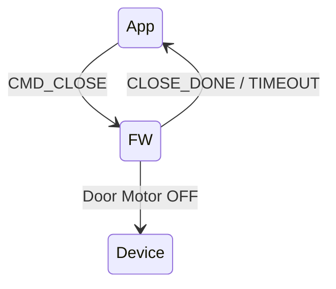
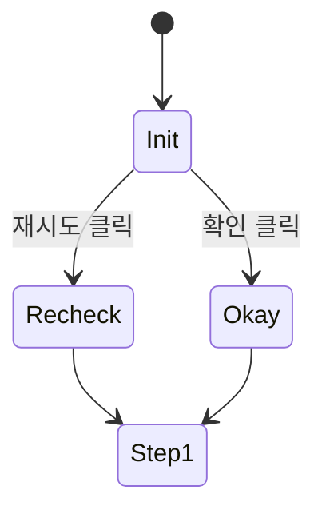

# App–Device Interaction State Specification

## 0. 문서 개요

### 목적

- App–FW–Device 간 동작을 **상태(State) 중심**으로 정의
- 화면 흐름, 사용자 입력, H/W 이벤트, 실패 처리 기준을 명확히 함
- QA 테스트 케이스 및 FW Command Spec의 기준 문서로 사용

### 대상

- App 개발자 (Flutter)
- FW 개발자
- QA
- 외주/신규 인력

------

## 1. 시스템 구성

| 구성요소      | 역할                          |
| ------------- | ----------------------------- |
| App (Flutter) | UI, 상태 관리, USB 통신       |
| FW (MCU)      | USB 프로토콜, RFID, Door 제어 |
| Device        | Door, RFID Reader, Sensor     |

------

## 2. 전체 화면/상태 흐름 요약

```
Splash
  ↓
Step1_Validation
  ↓
Step2_Open
  ↓
Step3_Close
  ↓
Step4_Measure & PostProcess
  ↺ Step1 (반복)
```

------

## 3. Splash Screen – USB 연결 상태

### 상태 다이어그램



### 상태 정의

| 상태          | 주체 | 설명                    |
| ------------- | ---- | ----------------------- |
| USBConnecting | App  | USB enumeration 요청    |
| USBConnected  | FW   | FW 정상 응답            |
| USBFailed     | App  | 타임아웃 또는 권한 오류 |
| StartEnabled  | App  | 사용자 진행 가능        |

### 실패 원인 (USBFailed)

| 코드       | 원인          |
| ---------- | ------------- |
| USB_ERR_01 | 케이블 미연결 |
| USB_ERR_02 | 권한 거부     |
| USB_ERR_03 | FW 응답 없음  |

------

## 4. Step1 – Validation Screen (전화번호 / RFID)

### 상태 다이어그램



### 상태 정의

| 상태         | 주체 | 설명               |
| ------------ | ---- | ------------------ |
| PhoneInput   | App  | 전화번호 입력 대기 |
| RfidScanning | FW   | RFID UID 수신      |
| RfidSuccess  | FW   | 인증 통과          |
| RfidFailed   | FW   | 인증 실패          |

### RFID 실패 사유

| 코드        | 설명          |
| ----------- | ------------- |
| RFID_ERR_01 | Timeout       |
| RFID_ERR_02 | Invalid UID   |
| RFID_ERR_03 | Duplicate UID |

------

## 5. Step2 – Open Screen (Door Open)

### 상태 다이어그램



### Command Flow



------

## 6. Step3 – Close Screen (Door Close)

### 상태 다이어그램



### Command Flow



------

## 7. Step4 – Measure & PostProcess

### 상태 다이어그램



### 표시 정보

| 항목        | 출처   |
| ----------- | ------ |
| Oil Level   | Sensor |
| Water Level | Sensor |

------

## 8. 자동 전이 / 사용자 전이 규칙

| 유형        | 예시              |
| ----------- | ----------------- |
| 사용자 전이 | 버튼 클릭         |
| 자동 전이   | Open 완료 → Step3 |
| FW 이벤트   | Sensor 감지       |

------

## 9. QA 테스트 케이스 추출 예시

| Case ID    | 조건       | 기대 결과  |
| ---------- | ---------- | ---------- |
| TC-USB-01  | USB 미연결 | USBFailed  |
| TC-RFID-02 | 잘못된 UID | RfidFailed |
| TC-OPEN-01 | 정상 Open  | Step3 진입 |