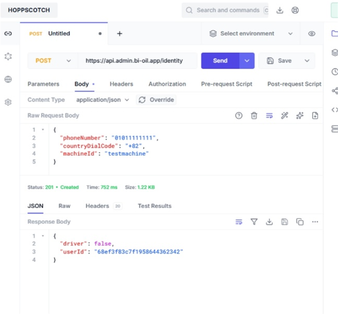
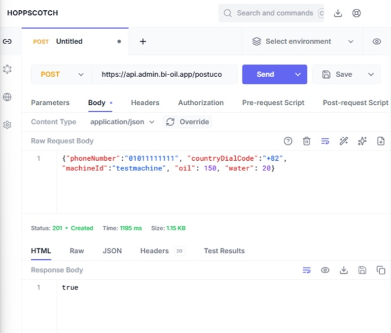

# Send_API_Feature






```
view → viewmodel → repository → api → model
```

------

## 📁 프로젝트 디렉터리 구조

```
lib/
 ├─ api/
 │   └─ user_api.dart
 ├─ repository/
 │   └─ user_repository.dart
 ├─ model/
 │   └─ user_request.dart
 ├─ viewmodel/
 │   └─ user_viewmodel.dart
 └─ view/
     └─ user_page.dart
```

------

## 📄 lib/model/user_request.dart

**API로 보낼 데이터 모델**

```
class UserRequest {
  final String name;
  final int age;
  final String email;

  UserRequest({
    required this.name,
    required this.age,
    required this.email,
  });

  Map<String, dynamic> toJson() {
    return {
      'name': name,
      'age': age,
      'email': email,
    };
  }
}
```

------

## 📄 lib/api/user_api.dart

**실제 HTTP 통신 담당 (Dio 사용)**

```
import 'package:dio/dio.dart';

class UserApi {
  final Dio dio;

  UserApi(this.dio);

  Future<Response> createUser(Map<String, dynamic> data) {
    return dio.post(
      '/user',
      data: data,
    );
  }
}
```

------

## 📄 lib/repository/user_repository.dart

**비즈니스 로직 계층 (Model ↔ API 연결)**

```
import '../api/user_api.dart';
import '../model/user_request.dart';

class UserRepository {
  final UserApi api;

  UserRepository(this.api);

  Future<void> createUser(UserRequest request) async {
    await api.createUser(request.toJson());
  }
}
```

------

## 📄 lib/viewmodel/user_viewmodel.dart

**상태 및 UI 로직 담당**

```
import '../model/user_request.dart';
import '../repository/user_repository.dart';

class UserViewModel {
  final UserRepository repository;

  UserViewModel(this.repository);

  Future<void> submitUser() async {
    final request = UserRequest(
      name: '홍길동',
      age: 30,
      email: 'test@test.com',
    );

    await repository.createUser(request);
  }
}
```

------

## 📄 lib/view/user_page.dart

**UI (버튼 클릭 → API 전송)**

```
import 'package:flutter/material.dart';
import 'package:dio/dio.dart';

import '../api/user_api.dart';
import '../repository/user_repository.dart';
import '../viewmodel/user_viewmodel.dart';

class UserPage extends StatelessWidget {
  UserPage({super.key});

  final viewModel = UserViewModel(
    UserRepository(
      UserApi(
        Dio(
          BaseOptions(
            baseUrl: 'https://example.com/api',
            headers: {
              'Content-Type': 'application/json',
              'Authorization': 'Bearer YOUR_TOKEN',
            },
          ),
        ),
      ),
    ),
  );

  @override
  Widget build(BuildContext context) {
    return Scaffold(
      appBar: AppBar(title: const Text('API 전송')),
      body: Center(
        child: ElevatedButton(
          onPressed: () async {
            await viewModel.submitUser();
          },
          child: const Text('데이터 전송'),
        ),
      ),
    );
  }
}
```

------

## ✅ 데이터 흐름 요약

```
UserPage (버튼 클릭)
  ↓
UserViewModel.submitUser()
  ↓
UserRepository.createUser()
  ↓
UserApi.createUser()
  ↓
Server API
```

