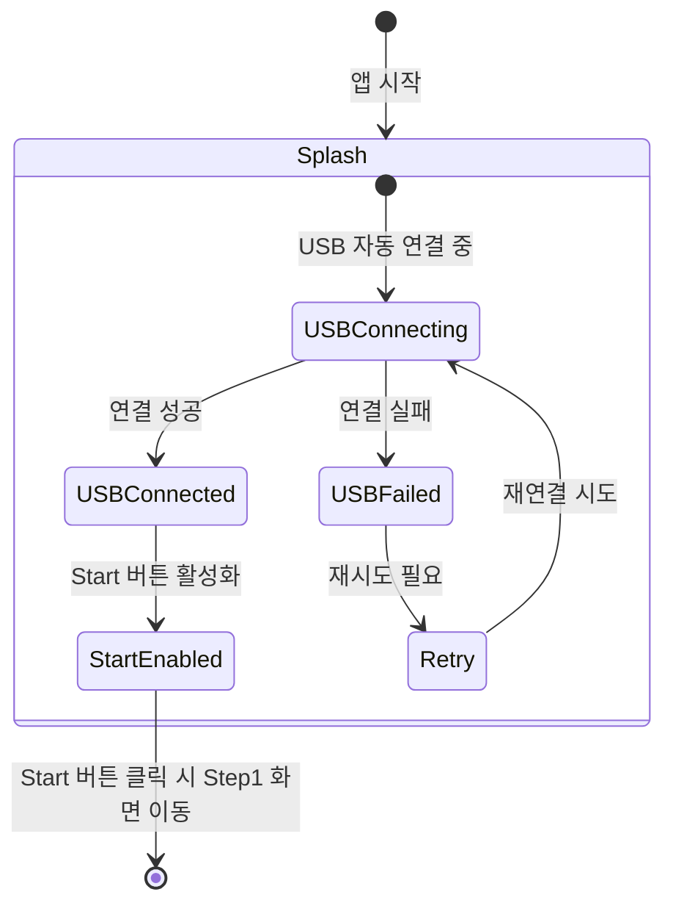
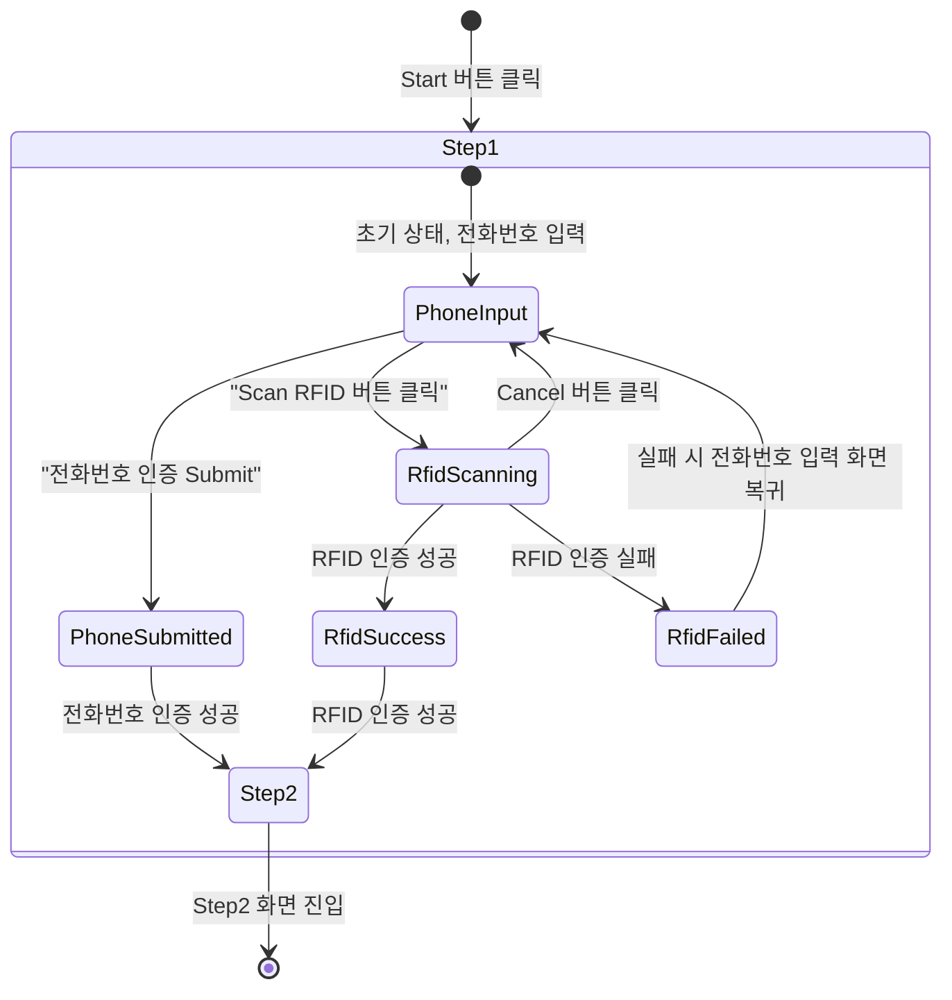
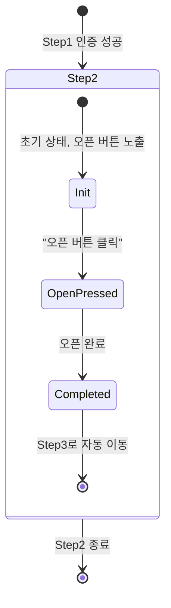
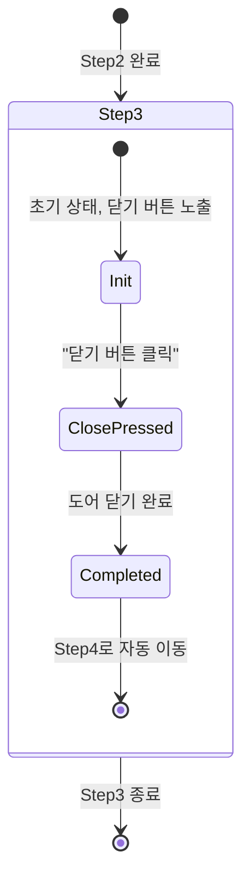
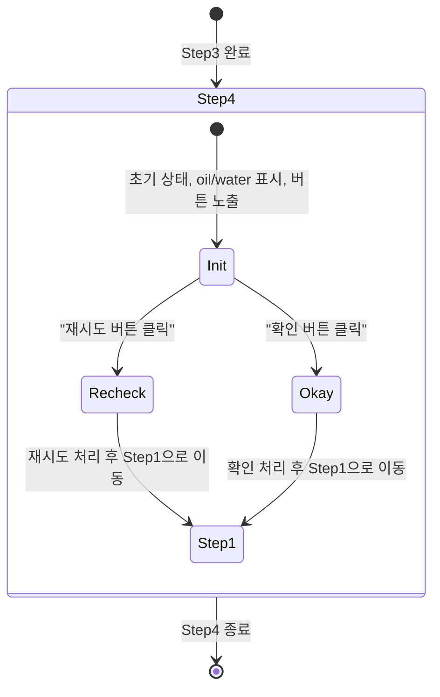

# App 스크린 상태도

## Splash Screen

```mermaid
stateDiagram-v2
    [*] --> Splash : 앱 시작

    state Splash {
        [*] --> USBConnecting : USB 자동 연결 중
        USBConnecting --> USBConnected : 연결 성공
        USBConnecting --> USBFailed : 연결 실패

        USBConnected --> StartEnabled : Start 버튼 활성화
        USBFailed --> Retry : 재시도 필요
        Retry --> USBConnecting : 재연결 시도
    }

    StartEnabled --> [*] : Start 버튼 클릭 시 Step1 화면 이동

```

## Step1_Validation Screen

```mermaid
stateDiagram-v2
    [*] --> Step1 : Start 버튼 클릭

    state Step1 {
        [*] --> PhoneInput : 초기 상태, 전화번호 입력

        PhoneInput --> RfidScanning : "Scan RFID 버튼 클릭"
        PhoneInput --> PhoneSubmitted : "전화번호 인증 Submit"

        RfidScanning --> RfidSuccess : RFID 인증 성공
        RfidScanning --> RfidFailed : RFID 인증 실패
        RfidScanning --> PhoneInput : Cancel 버튼 클릭

        RfidFailed --> PhoneInput : 실패 시 전화번호 입력 화면 복귀
        PhoneSubmitted --> Step2 : 전화번호 인증 성공

        RfidSuccess --> Step2 : RFID 인증 성공
    }

    Step2 --> [*] : Step2 화면 진입

```

## Step2_Open Screen

```mermaid
stateDiagram-v2
    [*] --> Step2 : Step1 인증 성공

    state Step2 {
        [*] --> Init : 초기 상태, 오픈 버튼 노출

        Init --> OpenPressed : "오픈 버튼 클릭"

        OpenPressed --> Completed : 오픈 완료

        Completed --> [*] : Step3로 자동 이동
    }

    Step2 --> [*] : Step2 종료

```

## Step3_Close Screen

```mermaid
stateDiagram-v2
    [*] --> Step3 : Step2 완료

    state Step3 {
        [*] --> Init : 초기 상태, 닫기 버튼 노출

        Init --> ClosePressed : "닫기 버튼 클릭"

        ClosePressed --> Completed : 도어 닫기 완료

        Completed --> [*] : Step4로 자동 이동
    }

    Step3 --> [*] : Step3 종료

```

## Step4_Measure & PostPer Screen

```mermaid
stateDiagram-v2
    [*] --> Step4 : Step3 완료

    state Step4 {
        [*] --> Init : 초기 상태, oil/water 표시, 버튼 노출

        Init --> Recheck : "재시도 버튼 클릭"
        Init --> Okay : "확인 버튼 클릭"

        Recheck --> Step1 : 재시도 처리 후 Step1으로 이동
        Okay --> Step1 : 확인 처리 후 Step1으로 이동
    }

    Step4 --> [*] : Step4 종료
```

